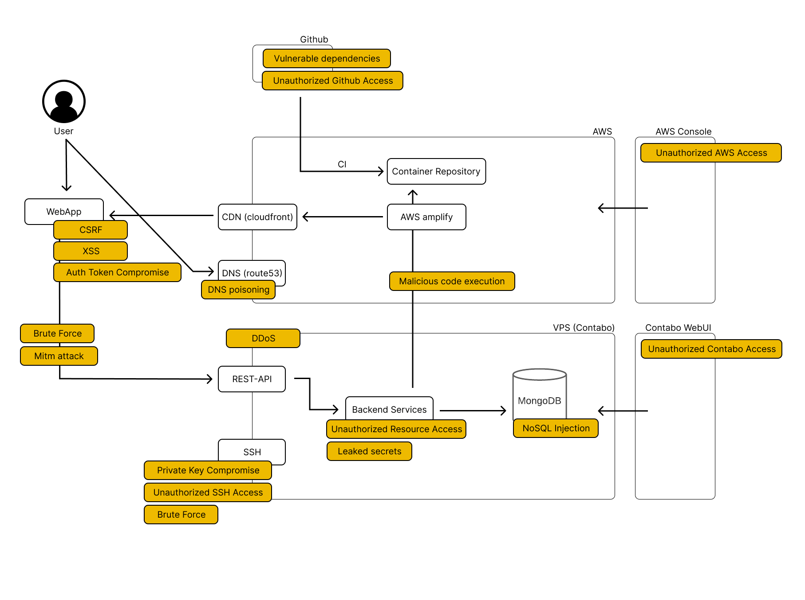
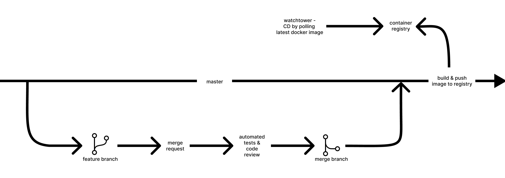

# spacey-backend
This repository contains all spacey backend services including the API Gateway written
in go.

## Services
### api
The api gateway is responsible for routing all requests from any client side facing app
to the corresponding microservice. It is also responsible for common tasks such as authentication, rate limiting and cors. The api is the only public facing service.

### user-service
The user service is responsible for handling all tasks related to issuing authentication tokens and managing user accounts.

### config-service
The config service provides simple access to configuration values for back and front end applications.

### deck-management-service
The deck management service is responsible for handling all tasks related to managing decks and their corresponding cards. It acts as a simple crud interface.

### learning-service
The learning service is responsible for handling all tasks related to learning and simple statistics such as a score of how well the user remembers the cards in a deck.
Each review of a card is stored as an event which therefore allows to track progress of a user over time.

### card-generation-service
The card generation service is not contained in this repository since it is written in python. It can be found [here](https://github.com/MoShrank/card-generation-service).


## User flow


## Files and Folders

`/config` <br>
package for handling configuration values. Each value has a default value that can be overwritten by a .env file.
`/pkg` <br>
package folder that contains all packages used across the project. <br>
`/services` <br>
folder which contains microservices.<br>
`build.sh` <br>
script to build all microservices as go apps<br>
`docker-compose.yml`<br>
simple docker compose file to start a local docker environment which also sets up
a docker network and the database.<br>
`mongo-init.js`<br>
init script for database setup to insert test user into db

## Run dev environment locally

### Prerequisites
- GO 1.17 needed
- docker & docker compose is needed

### Environment Variables
The following environment variables should be declared to run the backend locally. There are a few additional config values that can be set via environment variables, which can also be found in the config package. Those are not important for running the backend locally.

```
MONGO_DB_CONNECTION=<mongo_db_uri>
DB_NAME=<name_of_database>
PORT=<port_for_server>
```

### Serving the backend

- `make serve`

### Shutting the backend down

- `make cleanup`


### Running Tests

- `make test`

## API Routes

## Database
full description of collections can be found here: [collection](./docs/Collections.md)

## Security


full list of security measures can be found here: [security](./docs/Security.md)


## Deployment
The backend is deployed on a virtual private server uisng a docker compose file.
Continous Integration is done by a github workflow that runs unit tests on a pull request and builds and pushed the docker image to an AWS container registry. Continous deployment is then done by watchtower, a separate service running on the same server, that pools the latest docker images and deploys it.
