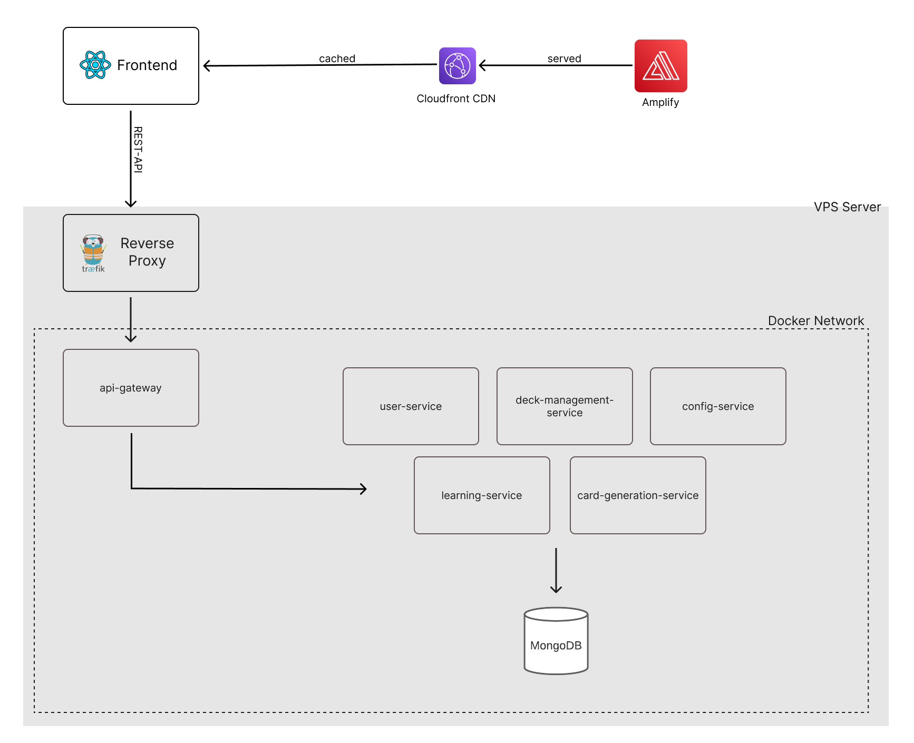

# spacey-backend

## Description
This repository contains all spacey backend services including the API Gateway written
in go.

### api
The api gateway is responsible for routing all requests from any client side facing app
to the corresponding microservice. It is also responsible for common tasks such as authentication, rate limiting and cors. The api is the only public facing service.

### user-service
The user service is responsible for handling all tasks related to issuing authentication tokens and managing user accounts.

### config-service
The config service provides simple access to configuration values for back and front end applications.

### deck-management-service
The deck management service is responsible for handling all tasks related to managing decks and their corresponding cards. It acts as a simple crud interface.

### learning-service
The learning service is responsible for handling all tasks related to learning and simple statistics such as a score of how well the user remembers the cards in a deck.
Each review of a card is stored as an event which therefore allows to track progress of a user over time.

### card-generation-service
The card generation service is not contained in this repository since it is written in python. It can be found [here](https://github.com/MoShrank/card-generation-service).

## User flow

## Files and Folders

    /config
    package for handling configuration values. Each value has a default value that can be overwritten by a .env file.
    /pkg
    package folder that contains all packages used across the project.
    /service
    folder which contains microservices.
    build.sh
    script to build all microservices as go apps
    docker-compose.yml
    simple docker compose file to start a local docker environment which also sets up
    a docker network and the database.
    mongo-init.js
    init script for database setup to insert test user into db

## Requirements
- GO 1.17 needed
- docker & docker compose needs to be installed to start the dev environment

## Run dev environment locally

- `./build.sh`
- `docker-compose up -d`

## API Routes

## CI/CD

## Deployment